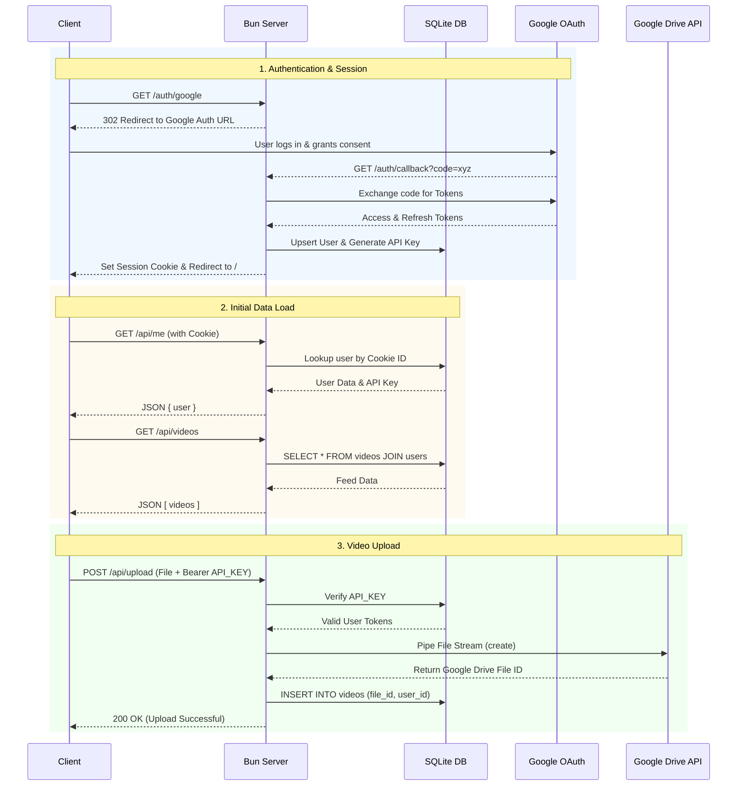

# System Architecture

## Backend Flow

The backend is built with Bun's native HTTP server (`Bun.serve`) and a local `bun:sqlite` database. It handles Google OAuth, session management, and piping uploads directly to the Google Drive API.

[[Frontend Flow]]